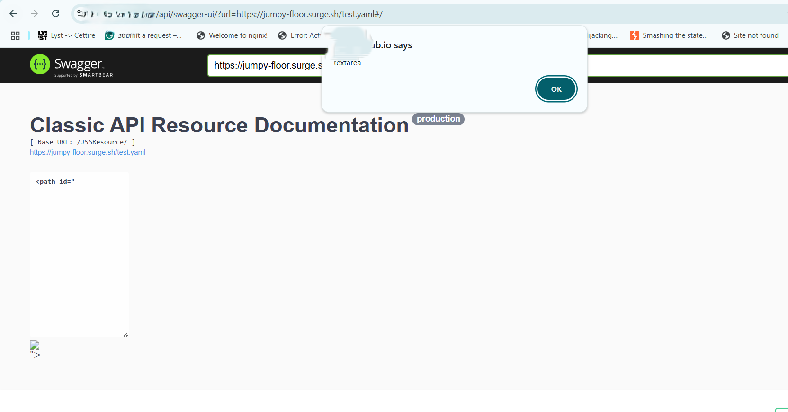

XSS-Cross Site Scripting

Every website(dynamic ones) functions are built with javascripts.

So a function such as clicking a button in a website will invoke the javascript function in the background.

But what if an attacker can input malicious javascript code into the website?

Yes this is known as cross site scripting. The attacker scripts the code from the other end.

## Vulnerable areas to look in a website

1. Search field  
2. Comment boxes  
3. Name field  
4. Or any other parameter  



## Example of cross site scripting

Consider you go to a website called example.com and you find a search box in it.

You search for a simple query "python'"

After that the url sent to the server to retrieve the results would be like:  
`example.com/search?q="python"`

But what attackers do here to invoke xss is input 'malicious javascript' code such as:

```html
<script>alert("xss")</script>


```

These malicious payloads gets embedded in the source code of the website and executes on the victim’s browser to exfiltrate sensitive information from them..

Biggest Query ( What most people asked me)
An Attacker performs xss on the victim? But what can he truly achieve?

A popup alert box on the victim’s browser can do no harm.

The above question can be answered as “severe” or “low” impact issue for the victim.

The primary objective of XSS is to get the session cookies.

The session cookies can be used by the attackers to impersonate the victims

Can't understand the above? (the second post would answer this)
